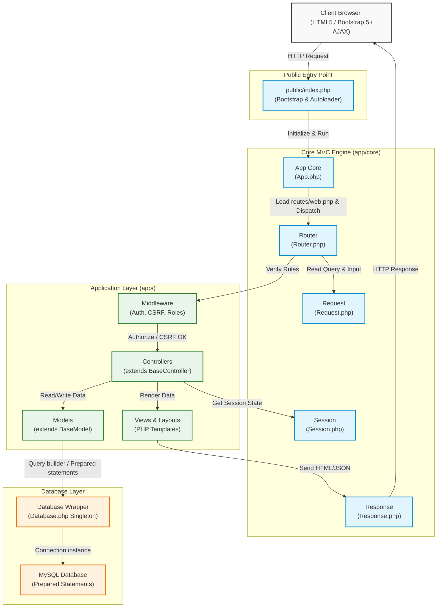
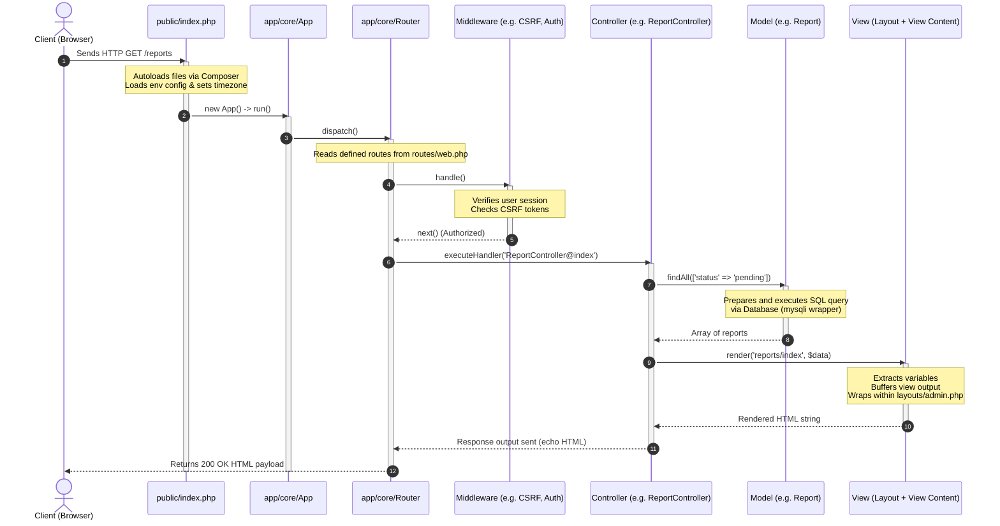
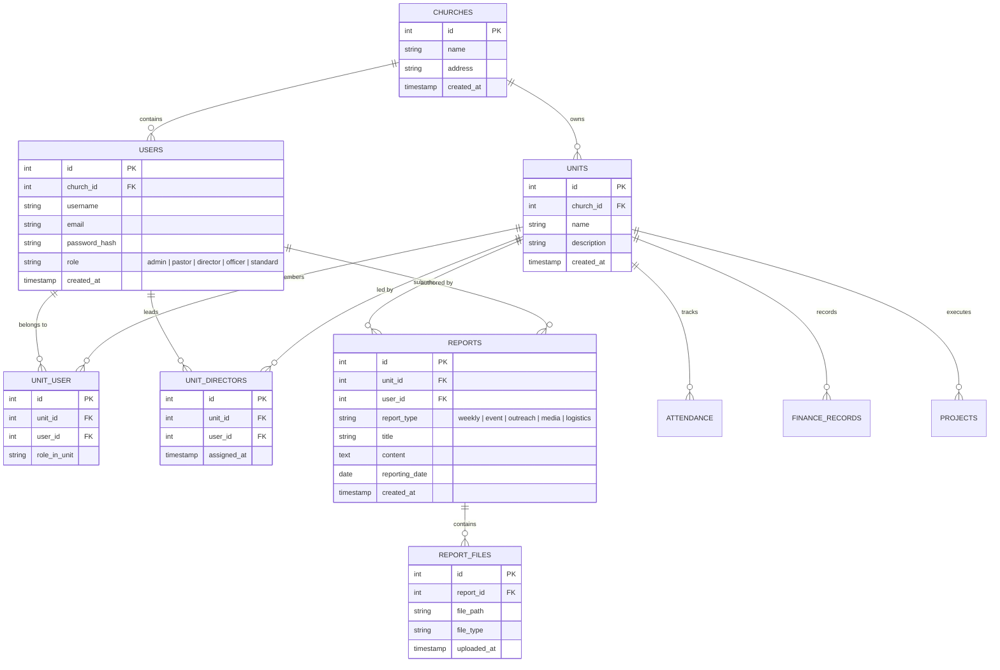
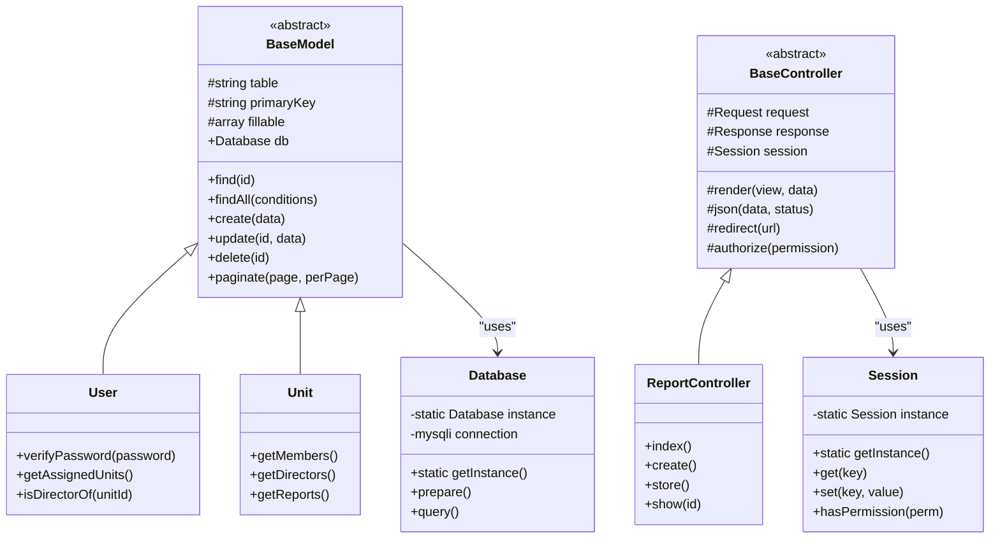

# Church Reporting & Administrative Portal Architecture

This document provides a comprehensive, visual, and conceptual breakdown of the architecture, data models, and request lifecycle for the **Church Reporting & Administrative Portal**.

---

## 1. High-Level System Architecture

The application is built on a custom, lightweight **MVC (Model-View-Controller)** engine implemented in PHP 8. It leverages a front controller pattern, custom routing engine, middleware system, and standard relational database access layers.

---

## 2. The Request-Response Lifecycle

Every HTTP request undergoes a structured routing, middleware filtration, and execution flow before returning a response to the client.

---

## 3. Core Database & Model Relationships (ERD)

The portal supports dynamic multi-department reporting structures. The diagram below represents the relationship between users, units, leadership assignments (directors), reports, and associated metadata.

---

## 4. Class Hierarchy & Architectural Design Patterns

The system relies on solid OOP patterns to separate concerns, enforce DRY principles, and ensure modularity:

*   **Singleton Pattern (`Database`, `Session`)**: Ensures only one active connection to the MySQL server and one PHP session instance exist at a time.
*   **Front Controller Pattern (`App`, `Router`)**: All client requests are funneled through a single file (`index.php`), ensuring uniform logging, configuration loading, security handling, and route dispatching.
*   **Base Pattern (`BaseModel`, `BaseController`)**: 
    *   `BaseModel` abstracts SQL operations (`find`, `findAll`, `create`, `update`, `delete`, `paginate`, `count`) using MySQLi prepared statements to automatically avoid SQL injection.
    *   `BaseController` implements custom output rendering (layout engines), redirection helpers, authorization logic, and payload validators.

---

## 5. Security Protocols Implemented

To safeguard ecclesiastical and financial records, the application integrates multiple layers of protection:

1.  **Strict Routing & Middleware**: Unauthenticated users are redirected to `/login` via the `AuthMiddleware`, and role restrictions are handled uniformly by checking the user session in `RoleMiddleware` or specific controller authorization points.
2.  **CSRF (Cross-Site Request Forgery) Tokens**: Built-in verification triggers on all mutate requests (POST, PUT, DELETE) through `CSRFMiddleware`.
3.  **Prepared Statements**: The core `BaseModel` requires all dynamic queries to bind parameter variables, completely neutralizing SQL Injection (SQLi) vulnerabilities.
4.  **XSS Sanitization & File Upload Safety**: All incoming request arguments are sanitized, and the file upload utility checks file extensions and MIME headers to prevent remote code execution.
