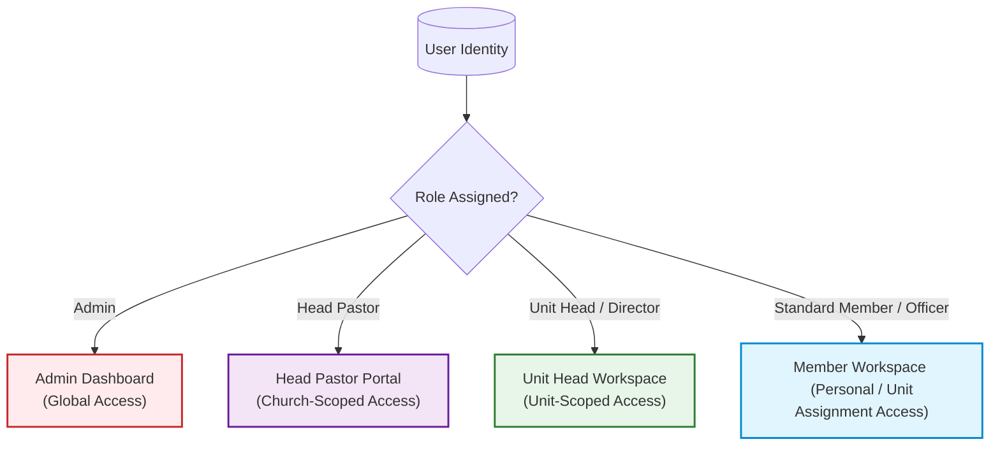
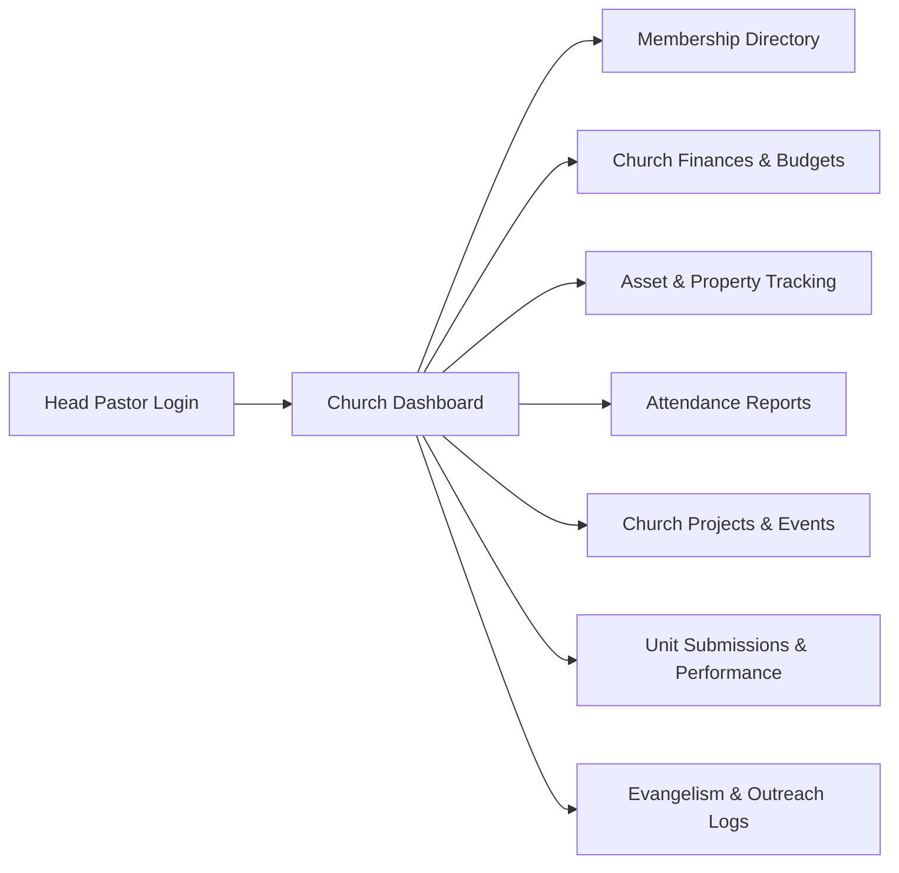
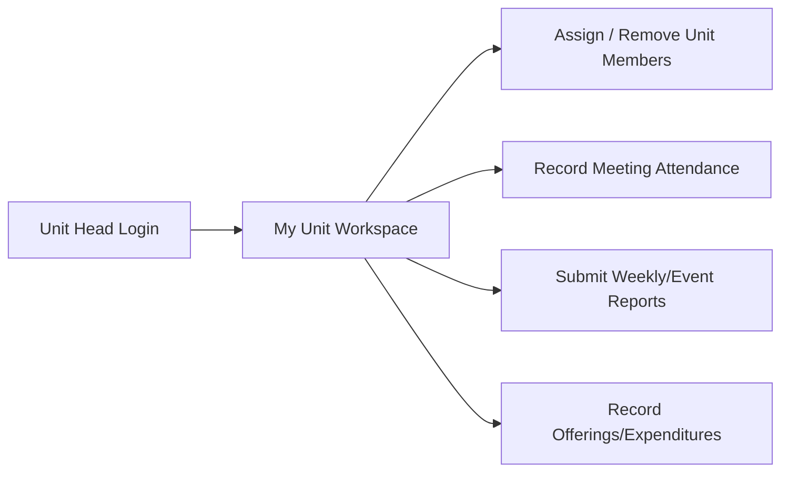

# User Flow & Functionality Guide

This guide outlines the core functional modules and user workflows of the **Church Reporting & Administrative Portal**. It illustrates how users of different roles navigate the system and access its features.

---

## 1. User Role Matrix

The portal defines four primary user roles, each with specific navigation scopes and actions:

---

## 2. Key User Flows

### A. Head Pastor Flow (Church Overview)
Head Pastors supervise a specific church congregation. They monitor departmental reports, manage assets, and track attendance.

### B. Unit Head / Director Flow (Departmental Workspace)
Directors manage one or multiple units (e.g., Choir, Media, Youth). They register team members, submit reports, and track unit finances.

---

## 3. Core Functionality Modules

### 1. Authentication & Session Management
*   **Secure Authentication**: Log in using email/username and bcrypt hashed passwords.
*   **Password Reset**: Users request resets, which must be approved or rejected by an administrator (`/admin/password-reset-requests`).
*   **CSRF Protection**: Form submissions require CSRF tokens validation.

### 2. Church & Unit Setup
*   **Churches Management**: Setup new local churches.
*   **Dynamic Unit Assignment**: Create departments (Units). Assign directors (can manage multiple units) and assign members to units.
*   **Target Settings**: Setup attendance and growth goals for churches and units (`/targets`).

### 3. Reporting System
*   **Unit Reports**: Departments submit weekly operational updates, attendance numbers, and notes.
*   **Outreach & Evangelism**: Detail program outcomes, including publicity channels used, logistical costs, attendance, decisions made, and target metrics (`/outreach-reports`).
*   **File Attachments**: Upload photos, media, and document attachments (`report_files`).
*   **Data Export**: Download reports as PDF, CSV, or Excel formats.

### 4. Financial Tracking
*   **Unit Budgets & Records**: Tracking of tithes, offerings, donations, expenses, and projects.
*   **Head Pastor Review**: Head pastors review transactions and export statements from their local church financial dashboard (`/churches/{id}/finance`).

### 5. Attendance & Follow-up
*   **Weekly Service Attendance**: Tracking attendance for main services and specific unit meetings.
*   **First-timer/Convert Follow-up**: Registering visitors, assigning follow-up team members, and updating completion status (`/follow-ups`).
*   **Personal Tracking**: Members can view their individual attendance history (`/attendance/my-history`).

### 6. Asset & Property Management
*   **Inventory Registry**: Keep track of equipment, furniture, and instruments owned by the church.
*   **Status Logs**: Track logs for status changes (e.g., active, damaged, lost).
*   **Assignments & Transfers**: Track who is assigned to an asset or initiate a transfer between departments.

### 7. Notification Broadcasts
*   **Announcements**: Create notifications targetable to specific churches, units, or global system audiences.
*   **Read Receipts**: Tracks individual user read status (`notifications_read`).
